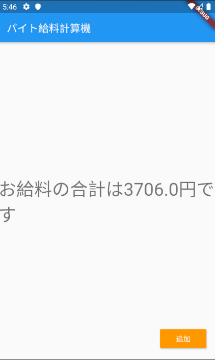
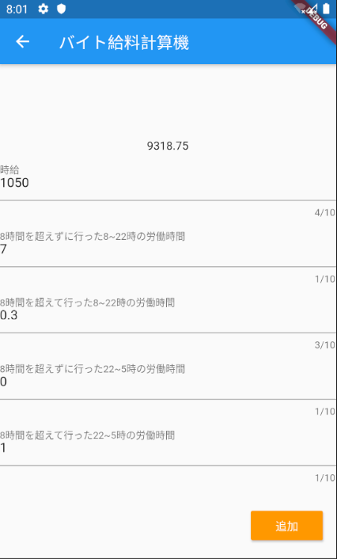
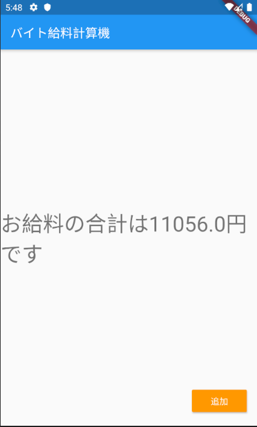

# バイト給料計算機

バイトの給料を計算するアプリ

## 作った理由

給料日前でもお給料が知りたい時があるから

## 変数

|変数名  |変数型  |役割  |
|---|---|---|
|pay  |double  |MyHomePageに表示される合計の給料額  |
|wages  |double  |MyInputPageの上に表示される数字であり、かつMyHomePageに渡す値 |
|per|double|時給を入力したテキストを小数型に変える|
|u8822|double|8時間を超えずに行った8~22時の労働時間を入力したテキストを小数型に変える 給与計算時に1倍される|
|o8822|double|8時間を超えて行った8~22時の労働時間を入力したテキストを小数型に変える 給与計算時に1.25倍される|
|u8225|double|8時間を超えずに行った22~5時の労働時間を入力したテキストを小数型に変える 給与計算時に1.25倍される|
|u8225|double|8時間を超えて行った22~5時の労働時間を入力したテキストを小数型に変える 給与計算時に1.5倍される|

## 使用画面

